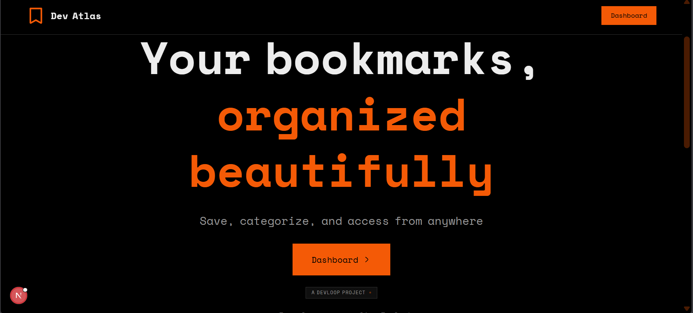
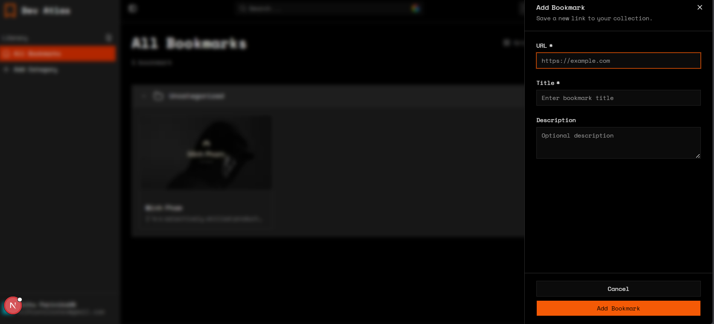

# Dev Atlas - Bookmark Manager

Dev Atlas is a production-ready bookmark manager built with Next.js and Supabase. It solves the fundamental problem of bookmark management by centralizing all your bookmarks, fetching metadata automatically, organizing resources by category, and enabling real-time synchronization across all your devices.

## 📸 Screenshots

### Landing Page


_Minimal, bold landing page with strong typography and a modern dark aesthetic_

### Dashboard - Add Bookmark Panel


_Clean side panel for adding new bookmarks with URL, title, and description._

### Dashboard - All Bookmarks


_View bookmarks in categorized groups with grid layout support and sorting options._


---

## Problems Solved

### 1. **Scattered Bookmarks**
**Problem:** Browser bookmarks are fragmented across different browsers and devices, making them impossible to find when needed.
**Solution:** Dev Atlas centralizes all bookmarks in one searchable location accessible from any device via Supabase sync.

### 2. **Manual Metadata Entry**
**Problem:** Users have to manually type title, description, and find preview images when saving links.
**Solution:** The `/api/fetch-metadata` endpoint automatically extracts:
- Page title from `<title>` tag, OpenGraph, or Twitter meta tags
- Description from OpenGraph or meta description
- Preview image (optimized to 300x169px WebP for thumbnails)
- Favicon (intelligently selected from multiple candidates, falling back to Google Favicon service)
- Special handling for YouTube (video ID extraction, maxresdefault.jpg) and Vimeo (API-based thumbnail fetching)

### 3. **Real-time Synchronization Challenges**
**Problem:** Traditional polling-based sync is resource-intensive and causes delays.
**Solution:** Implemented Supabase Realtime with broadcast channels:
- Database triggers send broadcast events on INSERT/UPDATE/DELETE
- Private channels scoped per user for security
- React Query invalidation ensures UI updates instantly
- Multiple tabs/windows show changes without page refresh

### 4. **Privacy and Data Isolation**
**Problem:** Multi-user systems face security risks without proper data isolation.
**Solution:** Row Level Security (RLS) policies ensure:
- Users can only view/edit their own bookmarks and categories
- Each user has isolated preferences
- Verifications at both database and API levels

### 5. **Bookmark Import Complexity**
**Problem:** Importing bookmarks from browsers requires manual folder organization and duplicate handling.
**Solution:** Browser import functionality with:
- Netscape bookmark format parsing
- Folder-to-category mapping
- Duplicate detection (by URL) with skip-existing option
- Bulk insert optimization (chunked requests)

### 6. **Insufficient Organization**
**Problem:** Flat bookmark lists don't scale; nested folders are confusing.
**Solution:** Category system with:
- Support for uncategorized bookmarks
- Category-based filtering and sorting

### 7. **Performance on Mobile**
**Problem:** Complex bookmark lists cause janky scrolling and poor UX on mobile.
**Solution:**
- Image proxy with lazy loading and WebP optimization
- Virtual scrolling for large lists (TanStack React Virtual)
- Responsive density adjustments (1-2 cols mobile, 2-8 cols desktop)
- Minimal JavaScript bundle size

---

## Core Features

**Google OAuth Only** - Streamlined signup/login via Google, no email/password required  
**Add Bookmarks** - Save URL + auto-fetched metadata (title, description)  
**Private Bookmarks** - Row Level Security ensures data isolation between users  
**Real-time Updates** - Changes sync instantly across all open tabs without page refresh  
**Delete Bookmarks** - Users can delete their own bookmarks  
**Category Organization** - Group bookmarks with 80+ custom icons and colors  
**Browser Import** - Drag & drop bookmark files with folder mapping and deduplication  
**Custom Media Override** - Replace auto-fetched images with custom ones  
**View Modes** - Toggle between card grid (2-8 columns) and compact list views  
**Grid Density** - Adjust columns per screen size (responsive 1-2 mobile, 2-8 desktop)  
**Context Menus** - Right-click for quick edit/delete/category actions  
**Bulk Operations** - Select multiple bookmarks for batch delete  
**Real-time Search** - Command palette (Cmd/Ctrl+K) to search bookmarks and navigate categories  
**Responsive Design** - Works seamlessly on desktop, tablet, and mobile  
**Performance** - Lazy loading, optimized rendering, minimal bundle  
**Dark/Light Themes** - System detection with manual override  

---

## Technical Stack

| Layer      | Technology                                 |
| ---------- | ------------------------------------------ |
| Framework  | Next.js 15 (App Router), React 19, TypeScript |
| Styling    | Tailwind CSS v4, Shadcn/ui, Base UI        |
| State      | TanStack React Query                       |
| Backend    | Supabase (PostgreSQL, Auth, Realtime, RLS)  |
| Forms      | Server Actions for OAuth                   |

---

## Deployment Guide

### Prerequisites
- GitHub account
- Supabase project (PostgreSQL + Auth + Realtime)
- Vercel account
- Google OAuth app credentials

### Step 1: Set Up Supabase

1. Create a new Supabase project at [supabase.com](https://supabase.com)
2. Run the SQL schema from `supabase/schema.sql` in the SQL editor
3. Enable OAuth for Google:
   - Go to Auth → Providers → Google
   - Add your Google OAuth credentials
   - Configure redirect URLs:
     - Local: `http://localhost:3000/auth/callback`
     - Production: `https://your-domain.com/auth/callback`

### Step 2: Deploy to Vercel

1. Push code to GitHub:
   ```bash
   git init
   git add .
   git commit -m "Initial commit"
   git branch -M main
   git remote add origin https://github.com/YOUR_USERNAME/bookmark-app-atlas.git
   git push -u origin main
   ```

2. Create Vercel deployment:
   - Go to [vercel.com](https://vercel.com)
   - Click "Add New" → "Project"
   - Import your GitHub repository
   - Configure environment variables:
     ```env
     NEXT_PUBLIC_SUPABASE_URL=your_supabase_url
     NEXT_PUBLIC_SUPABASE_PUBLISHABLE_KEY=your_anon_key
     NEXT_PUBLIC_SITE_URL=https://your-vercel-domain.vercel.app
     ```
   - Click Deploy

3. Add production URL to Google OAuth:
   - Go to your Google Cloud Console
   - Add redirect URI: `https://your-vercel-domain.vercel.app/auth/callback`

### Environment Variables

```env
# Required (from Supabase)
NEXT_PUBLIC_SUPABASE_URL=https://xxxxx.supabase.co
NEXT_PUBLIC_SUPABASE_PUBLISHABLE_KEY=eyAn...

# Required
NEXT_PUBLIC_SITE_URL=https://your-domain.com

# Optional (for analytics)
NEXT_PUBLIC_UMAMI_WEBSITE_ID=xxxxx
```

---

## Local Development

### Setup

```bash
# Clone and install
git clone https://github.com/YOUR_USERNAME/bookmark-app-atlas.git
cd bookmark
npm install

# Create .env.local
cat > .env.local << EOF
NEXT_PUBLIC_SUPABASE_URL=your_supabase_url
NEXT_PUBLIC_SUPABASE_PUBLISHABLE_KEY=your_anon_key
NEXT_PUBLIC_SITE_URL=http://localhost:3000
EOF

# Run development server
npm run dev

# Open http://localhost:3000
```

### Common Issues

**Issue:** "Cannot find module 'next'"
- **Solution:** Run `npm install` to install dependencies

**Issue:** Supabase connection error
- **Solution:** Check `NEXT_PUBLIC_SUPABASE_URL` and key in `.env.local`

**Issue:** OAuth redirect error
- **Solution:** Ensure `NEXT_PUBLIC_SITE_URL` matches Google OAuth redirect URIs

---

## Security

- **Row Level Security (RLS)** - PostgreSQL policies enforce user-level data isolation
- **Server-Side Auth** - All API routes verify user session
- **CSRF Protection** - Next.js built-in CSRF tokens
- **XSS Prevention** - React automatic escaping + Content Security Policy
- **HTTPS Only** - Enforced on production
- **OAuth** - Google handles password security, we store only session tokens

---

## Theme Colors

```css
--primary-orange: #F45A06;     /* Main accent */
--deep-orange: #C52A00;        /* Dark states, hover */
--black-bg: #000000;           /* Dark mode background */
--soft-white: #EDEDED;         /* Dark mode text */
```


